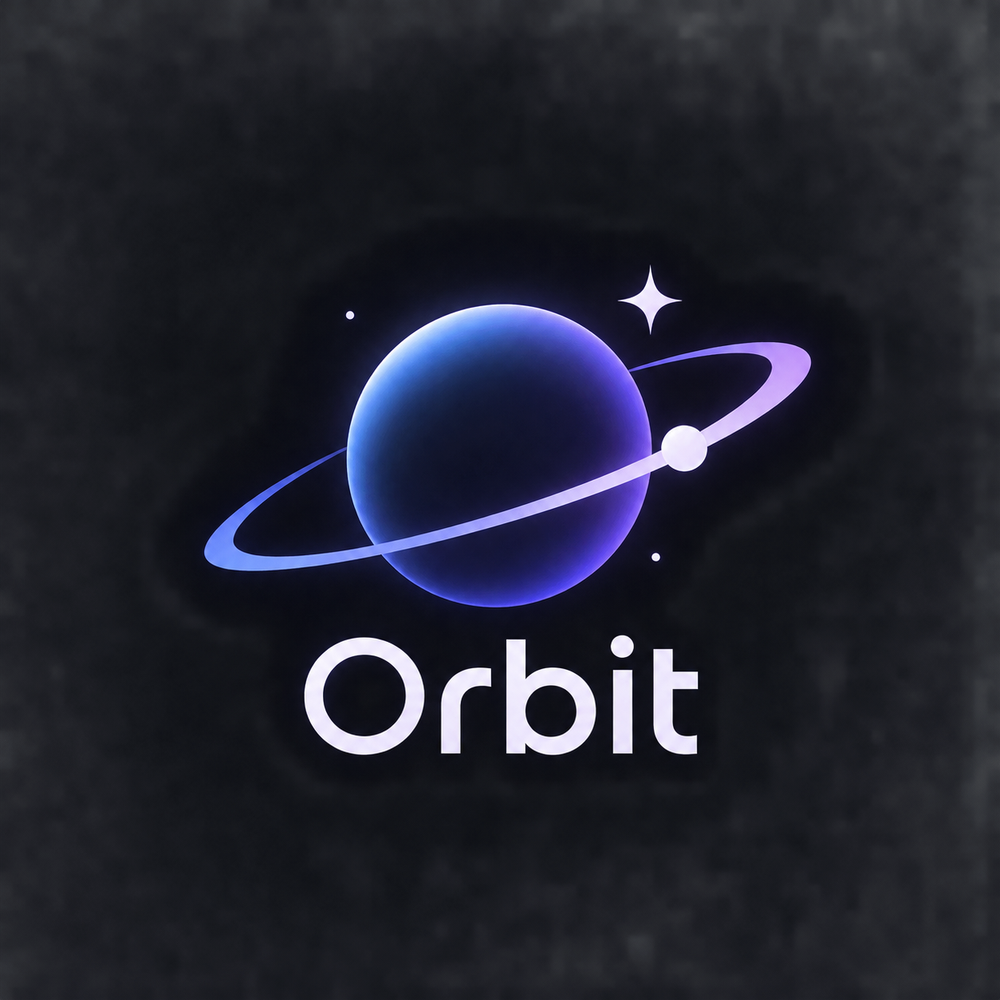

<!-- ======================= BANNER ======================= -->

  

 

<!-- ======================= INTRO ======================= -->

<h1 align="center">Hi, I'm Happy Mandowara 👋</h1>

  <b>2nd Year CSE Student @ IIIT Kota · Developer · Problem Solver</b>

  Building things, solving problems, and learning something new every day.

  
  &nbsp;&nbsp;&nbsp;
  
  &nbsp;&nbsp;&nbsp;
  

---

## About Me

I'm a second-year Computer Science Engineering student at **IIIT Kota**,
interested in software development, problem solving, and building practical
applications.

I enjoy working across the stack — from solving **Data Structures & Algorithms**
problems in C++ to building modern web applications and exploring backend
systems, databases, containers, and AI-assisted development.

- Strengthening my **Data Structures & Algorithms** fundamentals
- Building projects with **React, TypeScript, Node.js, and MongoDB**
- Exploring **Docker, Kubernetes, and backend architecture**
- Interested in building products that solve real-world problems

---

<!-- ======================= FEATURED PROJECT ======================= -->

## 🚀 Featured Project

  

<h2 align="center">Orbit</h2>

  <b>Habit Tracking & Journaling Application</b>

  A personal space to build better habits, track consistency,
  reflect on progress, and document your journey through journaling.

 

<strong>Tech Stack ⚙️</strong>

 

 

  

## Tech Stack ⚙️

  

  

  

  

---

## What I'm Currently Exploring

- Data Structures & Algorithms
- Full-Stack Web Development
- Backend Architecture
- Databases & System Design
- Docker & Kubernetes

---

 

  <i>Building. Learning. Improving.</i>

